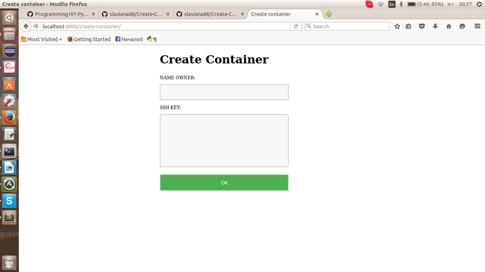
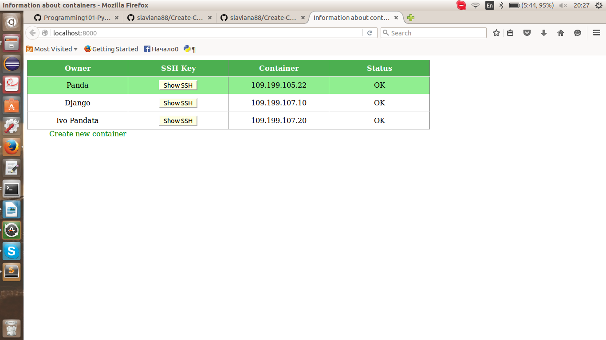

# Create Containers System

Django application, that communicates with API's Kyup to create new containers. 

Each customer adds the name and SSH Key in the following form:

And the following table shows the status of the containers"

* If you want to run application, first install `requirments.txt`.
* To create containers you should run the following command - `python3 manage.py create_container`.